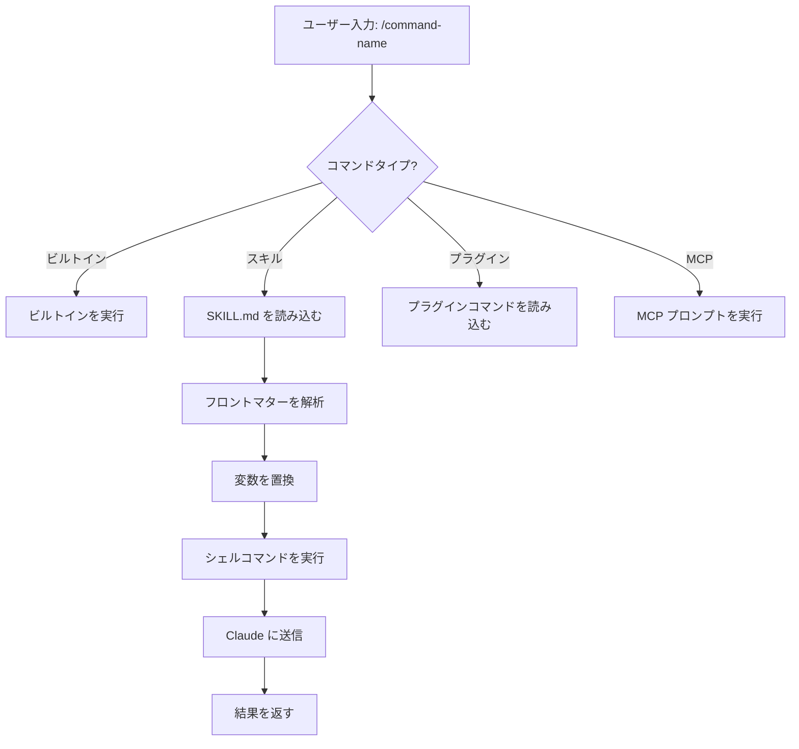

<picture>
  <source media="(prefers-color-scheme: dark)" srcset="../../resources/logos/claude-howto-logo-dark.svg">
  
</picture>

# スラッシュコマンド

## 概要

スラッシュコマンドは、インタラクティブセッション中に Claude の動作を制御するショートカットです。いくつかの種類があります：

- **ビルトインコマンド**: Claude Code が提供するコマンド（`/help`、`/clear`、`/model`）
- **スキル**: `SKILL.md` ファイルとして作成されるユーザー定義コマンド（`/optimize`、`/pr`）
- **プラグインコマンド**: インストール済みプラグインのコマンド（`/frontend-design:frontend-design`）
- **MCP プロンプト**: MCP サーバーからのコマンド（`/mcp__github__list_prs`）

> **注意**: カスタムスラッシュコマンドはスキルに統合されました。`.claude/commands/` 内のファイルは引き続き動作しますが、スキル（`.claude/skills/`）が推奨アプローチです。どちらも `/command-name` のショートカットを作成します。完全なリファレンスは [スキルガイド](../03-skills/) を参照してください。

## ビルトインコマンドリファレンス

ビルトインコマンドは一般的なアクションのショートカットです。**60以上のビルトインコマンド**と**5つのバンドルスキル**が利用可能です。Claude Code で `/` と入力すると全リストが表示されます。`/` の後に文字を入力するとフィルタリングできます。

| コマンド | 用途 |
|---------|---------|
| `/add-dir <path>` | 作業ディレクトリを追加 |
| `/agents` | エージェント設定を管理 |
| `/branch [name]` | 会話を新しいセッションに分岐（別名：`/fork`）。注: v2.1.77 で `/fork` から `/branch` に改名 |
| `/btw <question>` | 履歴に追加せずに質問 |
| `/chrome` | Chrome ブラウザ統合を設定 |
| `/clear` | 会話をクリア（別名：`/reset`、`/new`） |
| `/color [color\|default]` | プロンプトバーの色を設定 |
| `/compact [instructions]` | オプションのフォーカス指示付きで会話をコンパクト化 |
| `/config` | 設定を開く（別名：`/settings`） |
| `/context` | コンテキスト使用量をカラーグリッドで可視化 |
| `/copy [N]` | アシスタントの応答をクリップボードにコピー；`w` でファイルに書き込み |
| `/cost` | トークン使用統計を表示 |
| `/desktop` | Desktop アプリで続行（別名：`/app`） |
| `/diff` | コミットされていない変更のインタラクティブ差分ビューア |
| `/doctor` | インストールの状態を診断 |
| `/effort [low\|medium\|high\|xhigh\|max\|auto]` | インタラクティブな矢印キースライダーで努力レベルを設定。レベル：`low` → `medium` → `high` → `xhigh`（v2.1.111 追加）→ `max`。デフォルトは Opus 4.7 で `xhigh`；`max` は Opus 4.7 が必要 |
| `/exit` | REPL を終了（別名：`/quit`） |
| `/export [filename]` | 現在の会話をファイルまたはクリップボードにエクスポート |
| `/extra-usage` | レート制限の追加使用量を設定 |
| `/fast [on\|off]` | ファストモードを切り替え |
| `/feedback` | フィードバックを送信（別名：`/bug`） |
| `/focus` | フォーカスビューを切り替え（v2.1.110 追加；フォーカス切り替えの `Ctrl+O` を置き換え） |
| `/help` | ヘルプを表示 |
| `/hooks` | フック設定を表示 |
| `/ide` | IDE 統合を管理 |
| `/init` | `CLAUDE.md` を初期化。インタラクティブフローには `CLAUDE_CODE_NEW_INIT=1` を設定 |
| `/insights` | セッション分析レポートを生成 |
| `/install-github-app` | GitHub Actions アプリをセットアップ |
| `/install-slack-app` | Slack アプリをインストール |
| `/keybindings` | キーバインド設定を開く |
| `/less-permission-prompts` | 最近の Bash/MCP ツール呼び出しを分析し、パーミッションプロンプトを減らすための優先順位付きアローリストを `.claude/settings.json` に追加（v2.1.111 追加） |
| `/login` | Anthropic アカウントを切り替え |
| `/logout` | Anthropic アカウントからサインアウト |
| `/mcp` | MCP サーバーと OAuth を管理 |
| `/memory` | `CLAUDE.md` を編集、自動メモリを切り替え |
| `/mobile` | モバイルアプリ用 QR コード（別名：`/ios`、`/android`） |
| `/model [model]` | 左右矢印で努力レベルを調整しながらモデルを選択 |
| `/passes` | Claude Code の無料週を共有 |
| `/permissions` | パーミッションを表示/更新（別名：`/allowed-tools`） |
| `/plan [description]` | プランモードに入る |
| `/plugin` | プラグインを管理 |
| `/proactive` | `/loop` の別名（v2.1.105 追加） |
| `/powerup` | アニメーションデモ付きインタラクティブレッスンで機能を発見 |
| `/privacy-settings` | プライバシー設定（Pro/Max のみ） |
| `/release-notes` | 変更履歴を表示 |
| `/recap` | セッションに戻ったときにセッションの要約を表示（v2.1.108 追加） |
| `/reload-plugins` | アクティブなプラグインをリロード |
| `/remote-control` | claude.ai からリモートコントロール（別名：`/rc`） |
| `/remote-env` | デフォルトのリモート環境を設定 |
| `/rename [name]` | セッションの名前を変更 |
| `/resume [session]` | 会話を再開（別名：`/continue`） |
| `/review` | **非推奨** — 代わりに `code-review` プラグインをインストール |
| `/rewind` | 会話またはコードを巻き戻し（別名：`/checkpoint`） |
| `/sandbox` | サンドボックスモードを切り替え |
| `/schedule [description]` | クラウドのスケジュールタスクを作成/管理 |
| `/security-review` | ブランチのセキュリティ脆弱性を分析 |
| `/skills` | 利用可能なスキルをリスト |
| `/stats` | 日別使用量・セッション・ストリークを可視化 |
| `/stickers` | Claude Code ステッカーを注文 |
| `/status` | バージョン・モデル・アカウントを表示 |
| `/statusline` | ステータスラインを設定 |
| `/tasks` | バックグラウンドタスクをリスト/管理 |
| `/team-onboarding` | プロジェクトの Claude Code セットアップからチームメンバーのランプアップガイドを生成（v2.1.101 追加） |
| `/terminal-setup` | ターミナルキーバインドを設定 |
| `/theme` | カラーテーマを変更 |
| `/tui` | ちらつきのないレンダリングでフルスクリーン TUI モードを切り替え（v2.1.110 追加） |
| `/ultraplan <prompt>` | ultraplan セッションでプランを作成し、ブラウザでレビュー |
| `/ultrareview` | マルチエージェント分析による包括的なクラウドベースのコードレビュー（v2.1.111 追加） |
| `/undo` | `/rewind` の別名（v2.1.108 追加） |
| `/upgrade` | 上位プランへのアップグレードページを開く |
| `/usage` | プランの使用制限とレート制限ステータスを表示 |
| `/voice` | プッシュツートーク音声ディクテーションを切り替え |

### バンドルスキル

これらのスキルは Claude Code に同梱され、スラッシュコマンドのように呼び出せます：

| スキル | 用途 |
|-------|---------|
| `/batch <instruction>` | ワークツリーを使って大規模な並行変更をオーケストレート |
| `/claude-api` | プロジェクトの言語向け Claude API リファレンスを読み込む |
| `/debug [description]` | デバッグログを有効化 |
| `/loop [interval] <prompt>` | 指定間隔でプロンプトを繰り返し実行 |
| `/simplify [focus]` | 変更ファイルのコード品質をレビュー |

### 非推奨コマンド

| コマンド | ステータス |
|---------|--------|
| `/review` | 非推奨 — `code-review` プラグインに置き換え |
| `/output-style` | v2.1.73 以降非推奨 |
| `/fork` | `/branch` に改名（別名は引き続き動作、v2.1.77） |
| `/pr-comments` | v2.1.91 で削除 — PR コメントの表示は Claude に直接質問 |
| `/vim` | v2.1.92 で削除 — /config → エディタモードを使用 |

## カスタムコマンド（現在はスキル）

カスタムスラッシュコマンドは**スキルに統合**されました。どちらのアプローチも `/command-name` で呼び出せるコマンドを作成します：

| アプローチ | 場所 | ステータス |
|----------|----------|--------|
| **スキル（推奨）** | `.claude/skills/<name>/SKILL.md` | 現在の標準 |
| **レガシーコマンド** | `.claude/commands/<name>.md` | 引き続き動作 |

スキルとコマンドが同じ名前を持つ場合、**スキルが優先**されます。

### スキルの作成

ディレクトリと `SKILL.md` ファイルを作成します：

```bash
mkdir -p .claude/skills/my-command
```

**ファイル:** `.claude/skills/my-command/SKILL.md`

```yaml
---
name: my-command
description: このコマンドの説明と使用条件
---

# コマンドタイトル

このコマンドが呼び出されたときに Claude が従う指示。

1. 最初のステップ
2. 2番目のステップ
3. 3番目のステップ
```

### フロントマターリファレンス

| フィールド | 用途 | デフォルト |
|-------|---------|---------|
| `name` | コマンド名（`/name` になる） | ディレクトリ名 |
| `description` | 簡単な説明（Claude がいつ使うか判断するのに役立つ） | 最初の段落 |
| `argument-hint` | 自動補完用の期待される引数 | なし |
| `allowed-tools` | パーミッションなしで使えるツール | 継承 |
| `model` | 使用する特定のモデル | 継承 |
| `disable-model-invocation` | `true` の場合、ユーザーのみ呼び出し可（Claude は不可） | `false` |
| `user-invocable` | `false` の場合、`/` メニューから非表示 | `true` |
| `context` | `fork` に設定すると独立したサブエージェントで実行 | なし |
| `agent` | `context: fork` 使用時のエージェントタイプ | `general-purpose` |
| `hooks` | スキルスコープのフック（PreToolUse、PostToolUse、Stop） | なし |

### 引数

コマンドは引数を受け取れます：

**`$ARGUMENTS` で全引数：**

```yaml
---
name: fix-issue
description: 番号で GitHub Issue を修正
---

コーディング基準に従って Issue #$ARGUMENTS を修正してください
```

使用方法: `/fix-issue 123` → `$ARGUMENTS` は "123" になる

**`$0`、`$1` などで個別引数：**

```yaml
---
name: review-pr
description: 優先度付きで PR をレビュー
---

PR #$0 を優先度 $1 でレビューしてください
```

使用方法: `/review-pr 456 high` → `$0`="456"、`$1`="high"

### シェルコマンドによる動的コンテキスト

`` !`command` `` を使ってプロンプト前に bash コマンドを実行：

```yaml
---
name: commit
description: コンテキスト付きで git コミットを作成
allowed-tools: Bash(git *)
---

## コンテキスト

- 現在の git ステータス: !`git status`
- 現在の git 差分: !`git diff HEAD`
- 現在のブランチ: !`git branch --show-current`
- 最近のコミット: !`git log --oneline -5`

## タスク

上記の変更に基づいて、単一の git コミットを作成してください。
```

## コマンドアーキテクチャ



## このフォルダで利用可能なコマンド

### 1. `/optimize` — コード最適化

コードのパフォーマンス問題・メモリリーク・最適化の機会を分析します。

### 2. `/pr` — Pull Request 準備

リンティング・テスト・コミットフォーマットを含む PR 準備チェックリストをガイドします。

### 3. `/generate-api-docs` — API ドキュメントジェネレーター

ソースコードから包括的な API ドキュメントを生成します。

### 4. `/commit` — コンテキスト付き Git コミット

リポジトリからの動的コンテキストを使って git コミットを作成します。

### 5. `/push-all` — ステージング・コミット・プッシュ

すべての変更をステージングし、コミットを作成し、セーフティチェック付きでリモートにプッシュします。

### 6. `/doc-refactor` — ドキュメント再構成

明確さとアクセシビリティのためにプロジェクトドキュメントを再構成します。

### 7. `/setup-ci-cd` — CI/CD パイプラインセットアップ

品質保証のための pre-commit フックと GitHub Actions を実装します。

### 8. `/unit-test-expand` — テストカバレッジ拡張

未テストのブランチとエッジケースをターゲットにしてテストカバレッジを向上させます。

## インストール

### スキルとして（推奨）

```bash
# スキルディレクトリを作成
mkdir -p .claude/skills

# 各コマンドファイルのスキルディレクトリを作成
for cmd in optimize pr commit; do
  mkdir -p .claude/skills/$cmd
  cp 01-slash-commands/$cmd.md .claude/skills/$cmd/SKILL.md
done
```

### レガシーコマンドとして

```bash
# プロジェクト全体（チーム）
mkdir -p .claude/commands
cp 01-slash-commands/*.md .claude/commands/

# 個人使用
mkdir -p ~/.claude/commands
cp 01-slash-commands/*.md ~/.claude/commands/
```

## ベストプラクティス

| すべきこと | すべきでないこと |
|------|---------|
| 明確な行動指向の名前を使う | 一回限りのタスク用コマンドを作成する |
| トリガー条件付きの `description` を含める | コマンドに複雑なロジックを組み込む |
| コマンドを単一タスクに集中させる | 機密情報をハードコードする |
| 副作用には `disable-model-invocation` を使う | description フィールドをスキップする |
| 動的コンテキストには `!` プレフィックスを使う | Claude が現在の状態を知っていると仮定する |

## 関連ガイド

- **[スキル](../03-skills/)** — スキルの完全リファレンス（自動呼び出し機能）
- **[メモリ](../02-memory/)** — CLAUDE.md による永続的なコンテキスト
- **[サブエージェント](../04-subagents/)** — 委任 AI エージェント
- **[プラグイン](../07-plugins/)** — バンドルされたコマンドコレクション
- **[フック](../06-hooks/)** — イベント駆動の自動化

---

**最終更新**: 2026年4月16日
**Claude Code バージョン**: 2.1.112
**対応モデル**: Claude Sonnet 4.6, Claude Opus 4.7, Claude Haiku 4.5

*[Claude How To](../) ガイドシリーズの一部*
