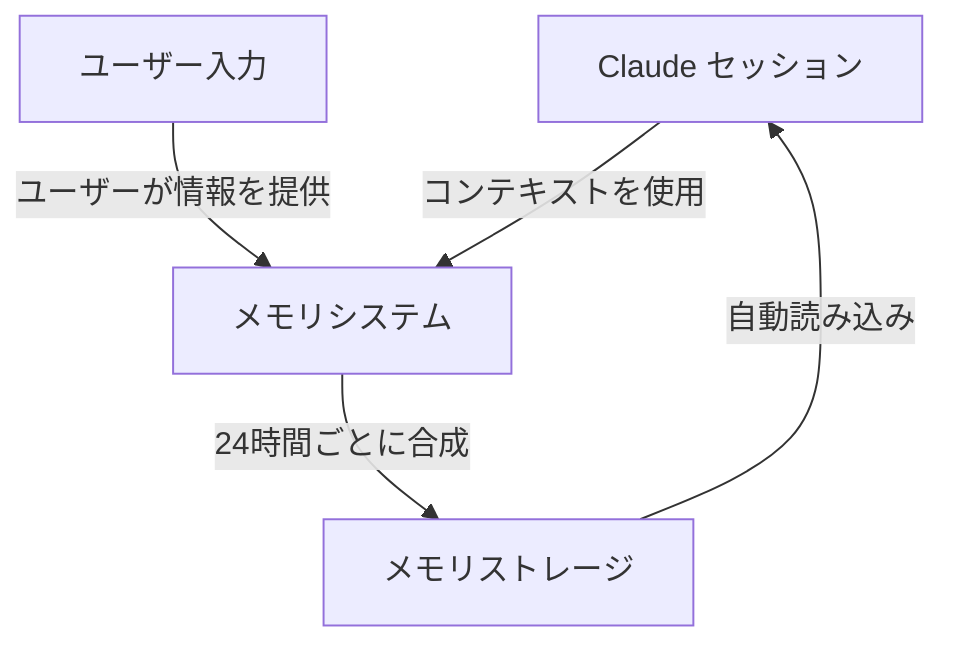
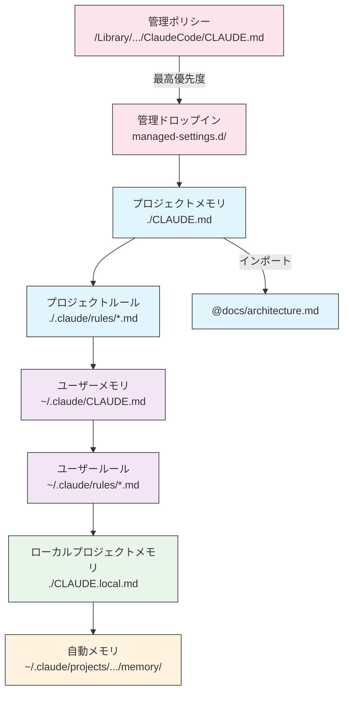
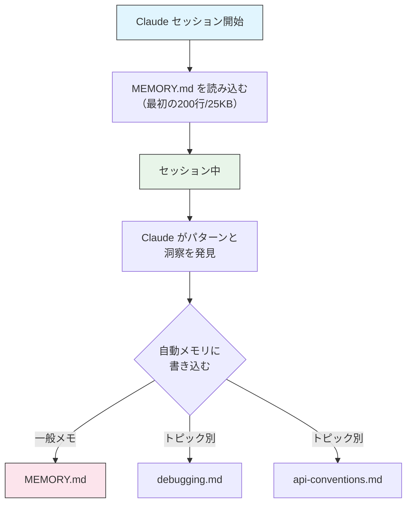

<picture>
  <source media="(prefers-color-scheme: dark)" srcset="../../resources/logos/claude-howto-logo-dark.svg">
  
</picture>

# メモリガイド

メモリにより、Claude はセッションや会話をまたいでコンテキストを保持できます。形式は2種類あります：claude.ai での自動合成と、Claude Code でのファイルシステムベースの CLAUDE.md です。

## 概要

Claude Code のメモリは、複数のセッションと会話にまたがる永続的なコンテキストを提供します。一時的なコンテキストウィンドウとは異なり、メモリファイルを使うと：

- チーム全体でプロジェクト標準を共有できる
- 個人の開発設定を保存できる
- ディレクトリ固有のルールと設定を維持できる
- 外部ドキュメントをインポートできる
- メモリをプロジェクトの一部としてバージョン管理できる

## メモリコマンドクイックリファレンス

| コマンド | 用途 | 使用方法 | 使うタイミング |
|---------|---------|-------|-------------|
| `/init` | プロジェクトメモリを初期化 | `/init` | 新しいプロジェクトの開始、初回の CLAUDE.md セットアップ |
| `/memory` | エディタでメモリファイルを編集 | `/memory` | 大規模な更新・再編成・内容のレビュー |
| `@path/to/file` | 外部コンテンツをインポート | `@README.md` または `@docs/api.md` | CLAUDE.md で既存のドキュメントを参照 |

## クイックスタート: メモリの初期化

### `/init` コマンド

`/init` コマンドは Claude Code でプロジェクトメモリをセットアップする最も速い方法です。CLAUDE.md ファイルを基本的なプロジェクトドキュメントで初期化します。

```bash
/init
```

**インタラクティブモードの有効化:**

```bash
CLAUDE_CODE_NEW_INIT=1 claude
/init
```

## メモリアーキテクチャ



## Claude Code のメモリ階層

Claude Code は多層階層メモリシステムを使用します。メモリファイルは Claude Code の起動時に自動的に読み込まれ、上位レベルのファイルが優先されます。

**完全なメモリ階層（優先順位順）:**

1. **管理ポリシー** — 組織全体の指示
   - macOS: `/Library/Application Support/ClaudeCode/CLAUDE.md`
   - Linux/WSL: `/etc/claude-code/CLAUDE.md`
   - Windows: `C:\Program Files\ClaudeCode\CLAUDE.md`

2. **管理ドロップイン** — アルファベット順にマージされるポリシーファイル（v2.1.83+）
   - 管理ポリシーの CLAUDE.md の隣にある `managed-settings.d/` ディレクトリ

3. **プロジェクトメモリ** — チーム共有コンテキスト（バージョン管理）
   - `./.claude/CLAUDE.md` または `./CLAUDE.md`

4. **プロジェクトルール** — モジュール式のトピック固有ルール
   - `./.claude/rules/*.md`

5. **ユーザーメモリ** — 個人設定（全プロジェクト共通）
   - `~/.claude/CLAUDE.md`

6. **ユーザーレベルルール** — 個人ルール（全プロジェクト共通）
   - `~/.claude/rules/*.md`

7. **ローカルプロジェクトメモリ** — 個人のプロジェクト固有設定
   - `./CLAUDE.local.md`

8. **自動メモリ** — Claude の自動メモ
   - `~/.claude/projects/<project>/memory/`



## `claudeMdExcludes` で CLAUDE.md を除外する

大規模なモノレポでは、一部の CLAUDE.md ファイルが現在の作業に無関係な場合があります。`claudeMdExcludes` 設定を使うと、特定の CLAUDE.md ファイルをスキップできます：

```jsonc
// ~/.claude/settings.json または .claude/settings.json に記述
{
  "claudeMdExcludes": [
    "packages/legacy-app/CLAUDE.md",
    "vendors/**/CLAUDE.md"
  ]
}
```

## モジュール式ルールシステム

`.claude/rules/` ディレクトリ構造を使って、整理されたパス固有のルールを作成できます：

```
your-project/
├── .claude/
│   ├── CLAUDE.md
│   └── rules/
│       ├── code-style.md
│       ├── testing.md
│       ├── security.md
│       └── api/
│           ├── conventions.md
│           └── validation.md

~/.claude/
├── CLAUDE.md
└── rules/
    ├── personal-style.md
    └── preferred-patterns.md
```

### YAML フロントマターによるパス固有ルール

特定のファイルパスにのみ適用されるルールを定義できます：

```markdown
---
paths: src/api/**/*.ts
---

# API 開発ルール

- すべての API エンドポイントに入力バリデーションを含める
- スキーマバリデーションに Zod を使用
- すべてのパラメータとレスポンスタイプをドキュメント化
- すべての操作にエラーハンドリングを含める
```

## 自動メモリ

自動メモリは、Claude がプロジェクトで作業しながら学習・パターン・洞察を自動的に記録する永続ディレクトリです。

- **場所**: `~/.claude/projects/<project>/memory/`
- **エントリポイント**: `MEMORY.md`（起動時に最初の200行/25KBが読み込まれる）
- **トピックファイル**: オンデマンドで読み込まれる追加ファイル



### 自動メモリの制御

```bash
# セッションで自動メモリを無効化
CLAUDE_CODE_DISABLE_AUTO_MEMORY=1 claude

# 自動メモリを明示的に有効化
CLAUDE_CODE_DISABLE_AUTO_MEMORY=0 claude
```

## 実践的な例

### 例1: セッション中のメモリ更新

```markdown
ユーザー: このプロジェクトでは常に React hooks を
          クラスコンポーネントの代わりに使うことを覚えておいて

Claude: メモリに追加します。どのメモリファイルに入れますか？
        1. プロジェクトメモリ (./CLAUDE.md)
        2. 個人メモリ (~/.claude/CLAUDE.md)

ユーザー: プロジェクトメモリ

Claude: ✅ メモリを保存しました！
```

## ベストプラクティス

### すべきこと
- **具体的かつ詳細に**: 曖昧なガイダンスではなく明確で詳細な指示を使う
- **整理する**: 明確な Markdown セクションと見出しでメモリファイルを構成
- **適切な階層レベルを使う**:
  - 管理ポリシー: 会社全体のポリシー・セキュリティ標準・コンプライアンス要件
  - プロジェクトメモリ: チーム標準・アーキテクチャ・コーディング規約（git にコミット）
  - ユーザーメモリ: 個人設定・コミュニケーションスタイル・ツールの選択
- **インポートを活用**: 既存のドキュメントを参照するために `@path/to/file` 構文を使う
- **プロジェクトメモリをバージョン管理**: プロジェクトレベルの CLAUDE.md ファイルをチームの利益のために git にコミット

### すべきでないこと
- **シークレットを保存しない**: API キー・パスワード・トークン・認証情報を絶対に含めない
- **コンテンツを重複させない**: 既存のドキュメントを参照するためにインポート（`@path`）を使う
- **曖昧にしない**: 「ベストプラクティスに従う」のような一般的な記述は避ける
- **長くしすぎない**: 個々のメモリファイルは500行以下に保つ
- **更新を忘れない**: 古いメモリは混乱を招く

## インストール手順

### プロジェクトメモリのセットアップ

```bash
# 1. プロジェクトディレクトリに移動
cd /path/to/your/project

# 2. Claude Code で init コマンドを実行
/init

# 3. 生成されたファイルをカスタマイズして git にコミット
git add CLAUDE.md
git commit -m "Initialize project memory with /init"
```

### 個人メモリのセットアップ

```bash
mkdir -p ~/.claude
touch ~/.claude/CLAUDE.md
```

## 関連リンク

- [MCP プロトコル](../05-mcp/) — メモリと組み合わせたライブデータアクセス
- [スラッシュコマンド](../01-slash-commands/) — セッション固有のショートカット
- [スキル](../03-skills/) — メモリコンテキストを使った自動化ワークフロー

---
**最終更新**: 2026年4月16日
**Claude Code バージョン**: 2.1.112
**対応モデル**: Claude Sonnet 4.6, Claude Opus 4.7, Claude Haiku 4.5

*[Claude How To](../) ガイドシリーズの一部*
