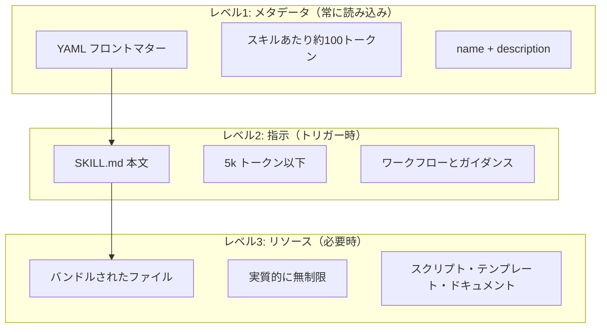

<picture>
  <source media="(prefers-color-scheme: dark)" srcset="../../resources/logos/claude-howto-logo-dark.svg">
  
</picture>

# エージェントスキルガイド

エージェントスキルは、Claude の機能を拡張する再利用可能なファイルシステムベースの機能です。ドメイン固有の専門知識・ワークフロー・ベストプラクティスを、Claude が関連するときに自動的に使用する検出可能なコンポーネントにパッケージ化します。

## 概要

**エージェントスキル**は、汎用エージェントを専門家に変えるモジュール式の機能です。プロンプト（一回限りのタスクのための会話レベルの指示）とは異なり、スキルはオンデマンドで読み込まれ、複数の会話で同じガイダンスを繰り返し提供する必要をなくします。

### 主なメリット

- **Claude を専門化**: ドメイン固有のタスク向けに機能を調整
- **繰り返しを減らす**: 一度作成すれば会話全体で自動的に使用
- **機能を組み合わせる**: スキルを組み合わせて複雑なワークフローを構築
- **ワークフローをスケール**: 複数のプロジェクトとチームで再利用
- **品質を維持**: ベストプラクティスをワークフローに直接埋め込む

## スキルの仕組み：プログレッシブディスクロージャー

スキルは**プログレッシブディスクロージャー**アーキテクチャを活用します — Claude は必要に応じて段階的に情報を読み込みます。

### 3つの読み込みレベル



多くのスキルをインストールしてもコンテキストペナルティなし — Claude はトリガーされるまで各スキルの存在と使用タイミングだけを知っています。

## スキルの作成

### 基本構造

```
.claude/skills/
└── my-skill/
    ├── SKILL.md          # 必須: 指示とフロントマター
    ├── scripts/          # 任意: 実行スクリプト
    └── templates/        # 任意: テンプレートファイル
```

### SKILL.md テンプレート

```yaml
---
name: my-skill
description: このスキルが何をするか、いつ使うかを説明（Claude が自動呼び出しの判断に使用）
argument-hint: [オプションの引数]
allowed-tools: Read, Bash(git *), Write
---

# スキルタイトル

## 概要

このスキルの目的。

## 指示

1. 最初のステップ
2. 2番目のステップ（必要に応じてファイルを参照: @templates/template.md）
3. 3番目のステップ

## 出力形式

- レスポンスのフォーマット方法
- 含めること
```

### フロントマターリファレンス

| フィールド | 用途 | デフォルト |
|-------|---------|---------|
| `name` | スキル名（`/name` コマンドになる） | ディレクトリ名 |
| `description` | Claude の自動呼び出し判断に使用される説明 | 最初の段落 |
| `argument-hint` | 自動補完用のヒント | なし |
| `allowed-tools` | パーミッションなしで使えるツール | 継承 |
| `disable-model-invocation` | `true` の場合、ユーザーのみ呼び出し可能 | `false` |
| `context` | `fork` に設定すると独立したサブエージェントで実行 | なし |
| `hooks` | スキルスコープのフック | なし |

## インストール

```bash
# スキルディレクトリを作成
mkdir -p .claude/skills

# このリポジトリからスキルをコピー
cp -r 03-skills/code-review .claude/skills/
cp -r 03-skills/doc-generator ~/.claude/skills/
```

## このフォルダのスキル

### `code-review/` — コードレビュー
セキュリティ・パフォーマンス・品質の問題を含む包括的なコードレビューを実施します。

**トリガー**: 「コードをレビューして」「PR をチェックして」などのリクエスト

### `brand-voice/` — ブランドボイス
ブランドのボイスとトーンガイドラインに合わせたコンテンツの一貫性を確保します。

### `claude-md/` — CLAUDE.md 生成
プロジェクトの CLAUDE.md ファイルを生成・更新します。

### `doc-generator/` — ドキュメントジェネレーター
コードから API ドキュメントを生成します。

### `refactor/` — リファクタリング
コードの品質・可読性・保守性を向上させるためにリファクタリングします。

## ベストプラクティス

| すべきこと | すべきでないこと |
|------|---------|
| 説明にトリガー条件を含める | 曖昧な説明を書く |
| スキルを単一のドメインに集中させる | 1つのスキルに無関係なタスクを入れる |
| 動的コンテキストに `!` プレフィックスを使う | スキルを非常に長くする |
| テンプレートとスクリプトをバンドルする | ハードコードされた設定を含める |

## 関連ガイド

- [スラッシュコマンド](../01-slash-commands/) — スラッシュコマンドとしてのスキル
- [サブエージェント](../04-subagents/) — 専門エージェントへの委任
- [フック](../06-hooks/) — スキルスコープのフック
- [プラグイン](../07-plugins/) — バンドルされたスキルコレクション

---
**最終更新**: 2026年4月16日
**Claude Code バージョン**: 2.1.112
**対応モデル**: Claude Sonnet 4.6, Claude Opus 4.7, Claude Haiku 4.5

*[Claude How To](../) ガイドシリーズの一部*
