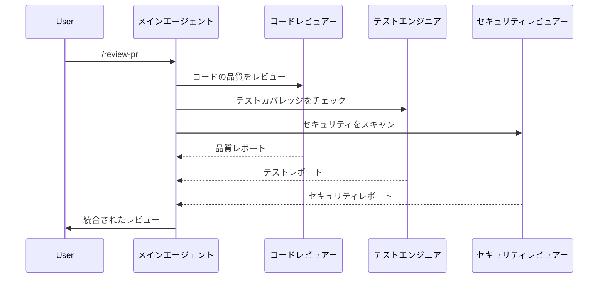

<picture>
  <source media="(prefers-color-scheme: dark)" srcset="../../resources/logos/claude-howto-logo-dark.svg">
  
</picture>

# サブエージェント — 完全リファレンスガイド

サブエージェントは、Claude Code がタスクを委任できる専門 AI アシスタントです。各サブエージェントは特定の目的を持ち、メイン会話とは独立したコンテキストウィンドウを使用し、特定のツールとカスタムシステムプロンプトで設定できます。

## 概要

サブエージェントは Claude Code での委任タスク実行を実現します：

- 独立したコンテキストウィンドウを持つ**専門 AI アシスタント**を作成
- 専門知識のための**カスタマイズされたシステムプロンプト**を提供
- 機能を制限するための**ツールアクセス制御**を実施
- 複雑なタスクからの**コンテキスト汚染**を防止
- 複数の専門タスクの**並列実行**を実現

各サブエージェントは独立して動作し、タスクに必要な特定のコンテキストのみを受け取り、結果をメインエージェントに返して統合します。

**クイックスタート**: `/agents` コマンドを使ってサブエージェントをインタラクティブに作成・表示・編集・管理できます。

## 主なメリット

| メリット | 説明 |
|---------|-------------|
| **コンテキストの保持** | 別のコンテキストで動作し、メイン会話の汚染を防止 |
| **専門知識** | 特定のドメインに特化してより高い成功率を実現 |
| **再利用性** | 異なるプロジェクト間で使用し、チームと共有 |
| **柔軟なパーミッション** | サブエージェントタイプに応じた異なるツールアクセスレベル |
| **スケーラビリティ** | 複数のエージェントが異なる側面を同時に処理 |

## ファイルの場所

| 優先度 | タイプ | 場所 | スコープ |
|----------|------|----------|-------|
| 1（最高） | **CLI 定義** | `--agents` フラグ経由（JSON） | セッションのみ |
| 2 | **プロジェクトサブエージェント** | `.claude/agents/` | 現在のプロジェクト |
| 3 | **ユーザーサブエージェント** | `~/.claude/agents/` | 全プロジェクト |
| 4（最低） | **プラグインエージェント** | プラグインの `agents/` ディレクトリ | プラグイン経由 |

## 設定

サブエージェントは YAML フロントマター付きの Markdown ファイルで設定します：

```yaml
---
name: code-reviewer
description: コードの品質・セキュリティ・パフォーマンスの問題についてコードをレビューする。コードレビューリクエストで自動的に使用される。
model: claude-sonnet-4-6
allowed-tools: Read, Grep, Bash(git diff *), Bash(git log *)
---

# コードレビュー専門エージェント

## 目的

コードの品質・セキュリティ・パフォーマンス・保守性について包括的なコードレビューを実施するシニア開発者として行動します。

## レビューフォーカスエリア

1. **コード品質** — 可読性・保守性・設計パターン
2. **セキュリティ** — 脆弱性・入力バリデーション・認証
3. **パフォーマンス** — アルゴリズムの複雑さ・データベースクエリ
4. **テスト** — カバレッジ・エッジケース・テスト品質
```

### 設定フィールド

| フィールド | 必須 | 説明 |
|-------|------|-------------|
| `name` | はい | サブエージェント識別子 |
| `description` | はい | 自動委任のトリガー |
| `model` | いいえ | 使用するモデル（デフォルト: 継承） |
| `allowed-tools` | いいえ | 許可されたツール |
| `context` | いいえ | コンテキスト継承（`fork` または `none`） |
| `memory` | いいえ | メモリスコープ（`user`・`project`・`local`） |

## このフォルダのサブエージェント

### `code-reviewer.md` — コードレビューエージェント
コードの品質・セキュリティ・パフォーマンスの問題を分析します。

### `test-engineer.md` — テストエンジニア
包括的なテスト戦略とカバレッジを確保します。

### `documentation-writer.md` — ドキュメントライター
技術ドキュメントを作成・改善します。

### `secure-reviewer.md` — セキュリティレビュアー
セキュリティ脆弱性と問題を特定します（読み取り専用）。

### `implementation-agent.md` — 実装エージェント
コーディング基準に従って機能を実装します。

### `debugger.md` — デバッガー
バグを診断して解決策を提案します。

### `data-scientist.md` — データサイエンティスト
データ分析とモデリングタスクを処理します。

### `performance-optimizer.md` — パフォーマンスオプティマイザー
コードとシステムのパフォーマンスを最適化します。

### `clean-code-reviewer.md` — クリーンコードレビュアー
クリーンコードの原則と保守性に集中します。

## インストール

```bash
# プロジェクトにコピー
cp 04-subagents/*.md .claude/agents/

# 個人使用（全プロジェクト）
cp 04-subagents/*.md ~/.claude/agents/
```

## サブエージェントの使い方

```markdown
# 明示的な委任
ユーザー: /code-reviewer このコードをレビューして

# 自動委任（説明に基づく）
ユーザー: このPRにセキュリティ問題がないかチェックして
Claude: → 自動的に secure-reviewer サブエージェントに委任

# マルチエージェントワークフロー
ユーザー: このPRを包括的にレビューして
Claude: → code-reviewer と test-engineer の両方に委任
```

## サブエージェントのチェーン



## ベストプラクティス

- サブエージェントをひとつの専門分野に集中させる
- 自動委任のために明確で具体的な説明を書く
- セキュリティに敏感なエージェントには `allowed-tools` を制限する
- 本番使用前にサブエージェントを独立してテストする

## 関連ガイド

- [スキル](../03-skills/) — 自動呼び出し機能
- [フック](../06-hooks/) — サブエージェントライフサイクルフック
- [プラグイン](../07-plugins/) — バンドルされたサブエージェントコレクション
- [MCP](../05-mcp/) — サブエージェントのための外部ツールアクセス

---
**最終更新**: 2026年4月16日
**Claude Code バージョン**: 2.1.112
**対応モデル**: Claude Sonnet 4.6, Claude Opus 4.7, Claude Haiku 4.5

*[Claude How To](../) ガイドシリーズの一部*
