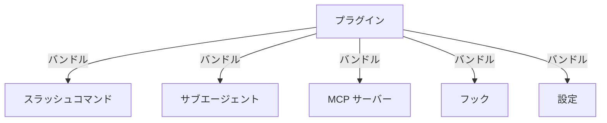

<picture>
  <source media="(prefers-color-scheme: dark)" srcset="../../resources/logos/claude-howto-logo-dark.svg">
  
</picture>

# Claude Code プラグイン

このフォルダには、複数の Claude Code 機能を一つのまとまったインストール可能なパッケージにバンドルした完全なプラグインの例が含まれています。

## 概要

Claude Code プラグインは、カスタマイズ（スラッシュコマンド・サブエージェント・MCP サーバー・フック）のバンドルされたコレクションで、1つのコマンドでインストールできます。複数の機能を一つのまとまった共有可能なパッケージに組み合わせる最高レベルの拡張メカニズムです。

## プラグインアーキテクチャ



## プラグインの種類と配布

| 種類 | スコープ | 共有 | 権限 | 例 |
|------|-------|--------|-----------|----------|
| 公式 | グローバル | 全ユーザー | Anthropic | PR レビュー・セキュリティガイダンス |
| コミュニティ | 公開 | 全ユーザー | コミュニティ | DevOps・データサイエンス |
| 組織 | 内部 | チームメンバー | 会社 | 内部標準・ツール |
| 個人 | 個人 | 単一ユーザー | 開発者 | カスタムワークフロー |

## インストール

```bash
# コマンドでプラグインをインストール
/plugin install pr-review
/plugin install devops-automation
/plugin install documentation

# インストール済みプラグインのリスト
/plugin list

# プラグインを削除
/plugin remove pr-review

# プラグインをリロード
/reload-plugins
```

## このフォルダのプラグイン

### `pr-review/` — PR レビューワークフロー

コード品質・セキュリティ・テストカバレッジの分析を含む包括的な PR レビューシステム。

**含まれる機能：**
- スラッシュコマンド: `/review-pr`・`/check-security`・`/check-tests`
- サブエージェント: `security-reviewer`・`test-checker`・`performance-analyzer`

```bash
/plugin install pr-review

# 使用方法
/review-pr         # 完全な PR レビュー
/check-security    # セキュリティのみチェック
/check-tests       # テストカバレッジをチェック
```

### `devops-automation/` — DevOps 自動化

デプロイ・インシデント管理・モニタリングのための完全な DevOps ツールキット。

**含まれる機能：**
- スラッシュコマンド: `/deploy`・`/rollback`・`/incident`・`/status`
- サブエージェント: `deployment-specialist`・`incident-commander`・`alert-analyzer`

```bash
/plugin install devops-automation

# 使用方法
/deploy production     # 本番にデプロイ
/rollback              # 前のバージョンにロールバック
/incident              # インシデント管理を開始
/status                # デプロイメントステータスを確認
```

### `documentation/` — ドキュメント生成

包括的なドキュメント生成システム。

**含まれる機能：**
- スラッシュコマンド: `/generate-api-docs`・`/generate-readme`・`/sync-docs`・`/validate-docs`
- サブエージェント: `api-documenter`・`code-commentator`・`example-generator`

```bash
/plugin install documentation

# 使用方法
/generate-api-docs    # API ドキュメントを生成
/generate-readme      # README を作成/更新
/sync-docs            # ドキュメントをコードに同期
/validate-docs        # ドキュメントの品質を確認
```

## プラグインの作成

### 基本構造

```
my-plugin/
├── .claude-plugin/
│   └── plugin.json    # プラグインマニフェスト
├── commands/          # スラッシュコマンド
├── agents/            # サブエージェント定義
├── hooks/             # フック設定
│   └── hooks.json
└── README.md          # プラグインのドキュメント
```

### plugin.json

```json
{
  "name": "my-plugin",
  "description": "私のプラグインの説明",
  "version": "1.0.0",
  "author": {
    "name": "Your Name"
  },
  "commands": ["commands/*.md"],
  "agents": ["agents/*.md"],
  "hooks": "hooks/hooks.json"
}
```

## ベストプラクティス

- プラグインは特定のワークフローに集中させる
- 明確なインストール手順とドキュメントを含める
- チームと共有する前にすべてのコンポーネントをテストする
- セキュリティに注意（プラグインは強力な機能へのアクセス権を持つ）
- 変更を追跡するためにバージョニングを使用する

## 関連ガイド

- [スラッシュコマンド](../01-slash-commands/) — 個別のコマンド
- [サブエージェント](../04-subagents/) — 個別のエージェント定義
- [フック](../06-hooks/) — 個別のフック設定
- [MCP](../05-mcp/) — 個別の MCP 設定

---
**最終更新**: 2026年4月16日
**Claude Code バージョン**: 2.1.112
**対応モデル**: Claude Sonnet 4.6, Claude Opus 4.7, Claude Haiku 4.5

*[Claude How To](../) ガイドシリーズの一部*
