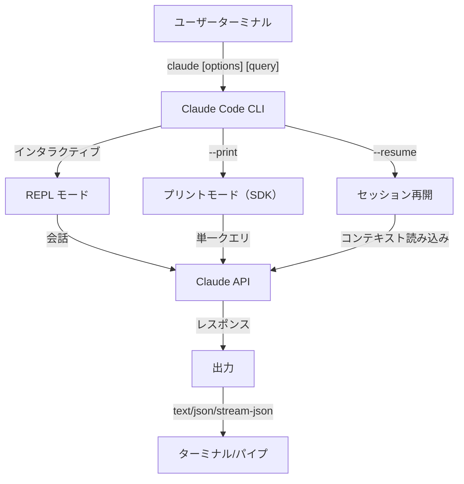

<picture>
  <source media="(prefers-color-scheme: dark)" srcset="../../resources/logos/claude-howto-logo-dark.svg">
  
</picture>

# CLI リファレンス

## 概要

Claude Code CLI（コマンドラインインターフェース）は、Claude Code と対話するための主要な手段です。クエリの実行・セッションの管理・モデルの設定・開発ワークフローへの Claude の統合に強力なオプションを提供します。

## アーキテクチャ



## CLI コマンド

| コマンド | 説明 | 例 |
|---------|-------------|---------|
| `claude` | インタラクティブ REPL を起動 | `claude` |
| `claude "query"` | 初期プロンプト付きで REPL を起動 | `claude "このプロジェクトを説明して"` |
| `claude -p "query"` | プリントモード — クエリして終了 | `claude -p "この関数を説明して"` |
| `cat file \| claude -p "query"` | パイプされたコンテンツを処理 | `cat logs.txt \| claude -p "説明して"` |
| `claude -c` | 最近の会話を続ける | `claude -c` |
| `claude -r "<session>" "query"` | ID または名前でセッションを再開 | `claude -r "auth-refactor" "この PR を仕上げて"` |
| `claude update` | 最新バージョンに更新 | `claude update` |
| `claude mcp` | MCP サーバーを設定 | [MCP ドキュメント](../05-mcp/) 参照 |
| `claude agents` | 設定済みサブエージェントをリスト | `claude agents` |
| `claude auth login` | ログイン | `claude auth login --email user@example.com` |
| `claude auth logout` | 現在のアカウントからログアウト | `claude auth logout` |
| `claude auth status` | 認証状態を確認 | `claude auth status` |

## 主要フラグ

| フラグ | 説明 | 例 |
|------|-------------|---------|
| `-p, --print` | インタラクティブモードなしでレスポンスを出力 | `claude -p "query"` |
| `-c, --continue` | 最近の会話を読み込む | `claude --continue` |
| `-r, --resume` | ID または名前で特定のセッションを再開 | `claude --resume auth-refactor` |
| `-v, --version` | バージョン番号を出力 | `claude -v` |
| `-w, --worktree` | 独立した git ワークツリーで起動 | `claude -w` |
| `-n, --name` | セッションの表示名 | `claude -n "auth-refactor"` |
| `--bare` | ミニマルモード（フック・スキル・プラグイン・MCP・自動メモリ・CLAUDE.md をスキップ） | `claude --bare` |
| `--effort` | 思考努力レベルを設定 | `claude --effort high` |

## 出力フォーマット

```bash
# デフォルト（テキスト）
claude -p "query"

# JSON 出力
claude -p --output-format json "query"

# ストリーミング JSON
claude -p --output-format stream-json "query"
```

## ユースケース

### CI/CD パイプラインへの統合

```bash
# テストを実行してレポートを生成
claude -p "テストを実行してレポートを生成して"

# ファイルのコードをレビュー
cat src/app.js | claude -p "このコードをレビューして"

# JSON 出力でスクリプトに統合
claude -p --output-format json "関数をリスト" | jq '.result'
```

### マルチセッションワークフロー

```bash
# 特定の名前でセッションを開始
claude -n "feature-auth" "認証機能を実装して"

# 後でそのセッションを再開
claude -r "feature-auth" "このセッションを続けて"

# 最近のセッションを続ける
claude -c "何かを修正して"
```

### ヘッドレスモード（自動化）

```bash
# スクリプトで使用
#!/bin/bash
result=$(claude -p "$(cat error.log) を分析して原因を説明して")
echo "$result"

# バッチ処理
for file in src/*.js; do
  claude -p "$(cat $file) をレビューして問題を探して" > "review_$(basename $file).md"
done
```

## パーミッションモード

| モード | 説明 |
|------|-------------|
| `default` | すべての操作でパーミッションを確認 |
| `acceptEdits` | ファイル編集を自動承認（bash コマンドは確認） |
| `plan` | 変更を提案するが実行はしない |
| `bypassPermissions` | すべての確認をスキップ（自動化に使用） |

```bash
# ファイル編集を自動承認して実行
claude --permission-mode acceptEdits "バグを修正して"
```

## 環境変数

| 変数 | 説明 |
|------|-------------|
| `ANTHROPIC_API_KEY` | Anthropic API キー |
| `CLAUDE_CODE_DISABLE_AUTO_MEMORY` | 自動メモリを無効化（`1`）または強制有効化（`0`） |
| `CLAUDE_CODE_NEW_INIT` | インタラクティブな `/init` フローを有効化 |

## 関連ガイド

- [スラッシュコマンド](../01-slash-commands/) — インタラクティブコマンド
- [MCP](../05-mcp/) — 外部ツール統合
- [フック](../06-hooks/) — 自動化と検証
- [上級機能](../09-advanced-features/) — プランニングモード・バックグラウンドタスク

---
**最終更新**: 2026年4月16日
**Claude Code バージョン**: 2.1.112
**対応モデル**: Claude Sonnet 4.6, Claude Opus 4.7, Claude Haiku 4.5

*[Claude How To](../) ガイドシリーズの一部*
