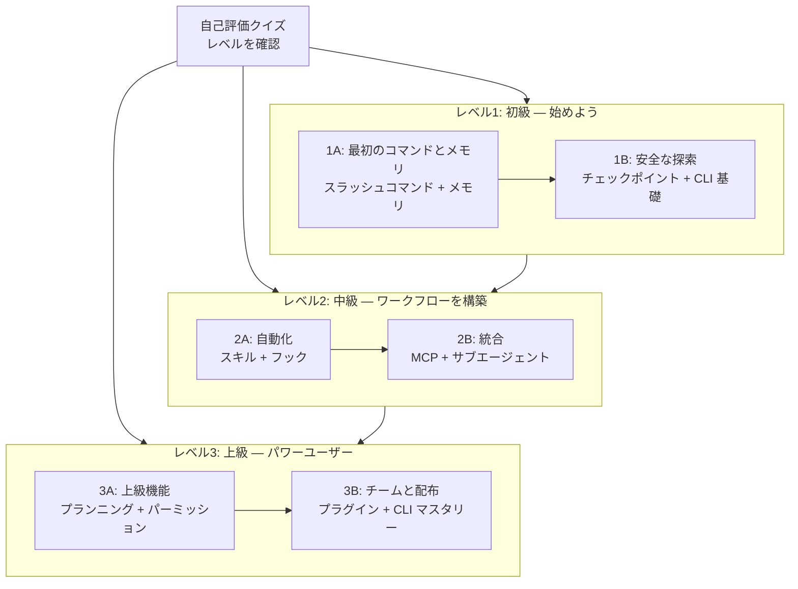

<picture>
  <source media="(prefers-color-scheme: dark)" srcset="../resources/logos/claude-howto-logo-dark.svg">
  
</picture>

# 学習ロードマップ

**Claude Code が初めてですか？** このガイドは自分のペースで Claude Code の機能をマスターするのに役立ちます。完全な初心者から経験豊富な開発者まで、以下の自己評価クイズから始めて自分に適したパスを見つけましょう。

---

## レベルを確認する

誰もが同じ出発点から始まるわけではありません。このクイックセルフアセスメントで適切なエントリーポイントを見つけてください。

**正直に答えてください：**

- [ ] Claude Code を起動して会話できる（`claude`）
- [ ] CLAUDE.md ファイルを作成または編集したことがある
- [ ] 少なくとも3つのビルトインスラッシュコマンドを使ったことがある（例：/help、/compact、/model）
- [ ] カスタムスラッシュコマンドまたはスキル（SKILL.md）を作成したことがある
- [ ] MCP サーバーを設定したことがある（例：GitHub、データベース）
- [ ] ~/.claude/settings.json にフックを設定したことがある
- [ ] カスタムサブエージェント（.claude/agents/）を作成または使用したことがある
- [ ] スクリプトや CI/CD のためにプリントモード（`claude -p`）を使ったことがある

**あなたのレベル：**

| チェック数 | レベル | 開始場所 | 完了目安時間 |
|--------|-------|----------|------------------|
| 0〜2 | **レベル1: 初級** — 始めよう | [マイルストーン1A](#マイルストーン1a-最初のコマンドとメモリ) | 約3時間 |
| 3〜5 | **レベル2: 中級** — ワークフローを構築 | [マイルストーン2A](#マイルストーン2a-自動化スキルとフック) | 約5時間 |
| 6〜8 | **レベル3: 上級** — パワーユーザーとチームリード | [マイルストーン3A](#マイルストーン3a-上級機能) | 約5時間 |

> **ヒント**: 迷った場合は1レベル下から始めましょう。基礎的な概念を見逃すよりも、なじみのある内容を素早くレビューする方が良いです。

> **インタラクティブ版**: Claude Code で `/self-assessment` を実行すると、10の機能エリア全体で習熟度を評価するガイド付きのインタラクティブなクイズが実行され、パーソナライズされた学習パスが生成されます。

---

## 学習哲学

このリポジトリのフォルダは3つの主要原則に基づいて**推奨学習順**に番号が付けられています：

1. **依存関係** — 基礎となる概念が先
2. **複雑さ** — 簡単な機能から上級機能へ
3. **使用頻度** — 最もよく使われる機能を最初に教える

---

## あなたの学習パス

---

## レベル1: 初級 — 始めよう

### マイルストーン1A: 最初のコマンドとメモリ

**目標**: Claude Code を生産的に使い始める

| 順番 | モジュール | 内容 | 時間 |
|-------|--------|-------|------|
| 1 | [スラッシュコマンド](01-slash-commands/) | 最初のスラッシュコマンドを作成して使う | 30分 |
| 2 | [メモリ](02-memory/) | CLAUDE.md でプロジェクトコンテキストを設定 | 45分 |

**このマイルストーン後の成果物:**
- `optimize.md` などをインストールした最初のカスタムコマンド
- チームの標準を文書化した基本的な `CLAUDE.md`

### マイルストーン1B: 安全な探索

| 順番 | モジュール | 内容 | 時間 |
|-------|--------|-------|------|
| 3 | [チェックポイント](08-checkpoints/) | 大きな変更をロールバックして複数のアプローチを試す | 45分 |
| 4 | [CLI 基礎](10-cli/) | 基本的なコマンドラインオプション | 30分 |

---

## レベル2: 中級 — ワークフローを構築

### マイルストーン2A: 自動化スキルとフック

| 順番 | モジュール | 内容 | 時間 |
|-------|--------|-------|------|
| 5 | [スキル](03-skills/) | 自動的に使われる再利用可能な機能を作成 | 1時間 |
| 6 | [フック](06-hooks/) | 保存やコミット時に自動チェックを実行 | 1時間 |

### マイルストーン2B: 統合

| 順番 | モジュール | 内容 | 時間 |
|-------|--------|-------|------|
| 7 | [MCP](05-mcp/) | GitHub・データベース・外部サービスに接続 | 1時間 |
| 8 | [サブエージェント](04-subagents/) | 専門エージェントにタスクを委任 | 1.5時間 |

---

## レベル3: 上級 — パワーユーザーとチームリード

### マイルストーン3A: 上級機能

| 順番 | モジュール | 内容 | 時間 |
|-------|--------|-------|------|
| 9 | [上級機能](09-advanced-features/) | プランニングモード・バックグラウンドタスク・パーミッションモード | 2〜3時間 |

### マイルストーン3B: チームと配布

| 順番 | モジュール | 内容 | 時間 |
|-------|--------|-------|------|
| 10 | [プラグイン](07-plugins/) | バンドルされた機能を作成してチームと共有 | 2時間 |

---

## 機能の組み合わせ

本当のパワーは機能の組み合わせにあります。以下は構築できる最も価値のあるワークフローです：

| ワークフロー | 組み合わせる機能 | 難易度 |
|----------|-----------------|--------|
| **自動コードレビュー** | スラッシュコマンド + サブエージェント + MCP | 中級 |
| **チームオンボーディング** | メモリ + スラッシュコマンド + プラグイン | 中級 |
| **CI/CD パイプライン** | CLI + フック + バックグラウンドタスク | 上級 |
| **ドキュメント生成** | スキル + サブエージェント + プラグイン | 上級 |

---

## 完全学習パス（11〜13時間）

| 順番 | モジュール | レベル | 時間 |
|-------|--------|-------|------|
| 1 | [スラッシュコマンド](01-slash-commands/) | 初級 | 30分 |
| 2 | [メモリ](02-memory/) | 初級+ | 45分 |
| 3 | [チェックポイント](08-checkpoints/) | 中級 | 45分 |
| 4 | [CLI 基礎](10-cli/) | 初級+ | 30分 |
| 5 | [スキル](03-skills/) | 中級 | 1時間 |
| 6 | [フック](06-hooks/) | 中級 | 1時間 |
| 7 | [MCP](05-mcp/) | 中級+ | 1時間 |
| 8 | [サブエージェント](04-subagents/) | 中級+ | 1.5時間 |
| 9 | [上級機能](09-advanced-features/) | 上級 | 2〜3時間 |
| 10 | [プラグイン](07-plugins/) | 上級 | 2時間 |

---

**最終更新**: 2026年4月16日
**対応モデル**: Claude Sonnet 4.6, Claude Opus 4.7, Claude Haiku 4.5
