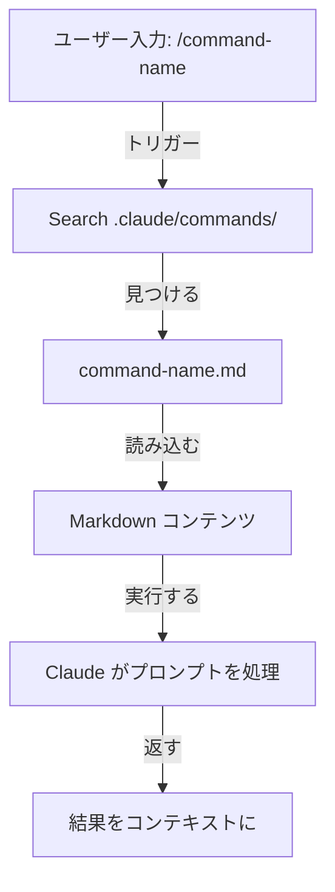
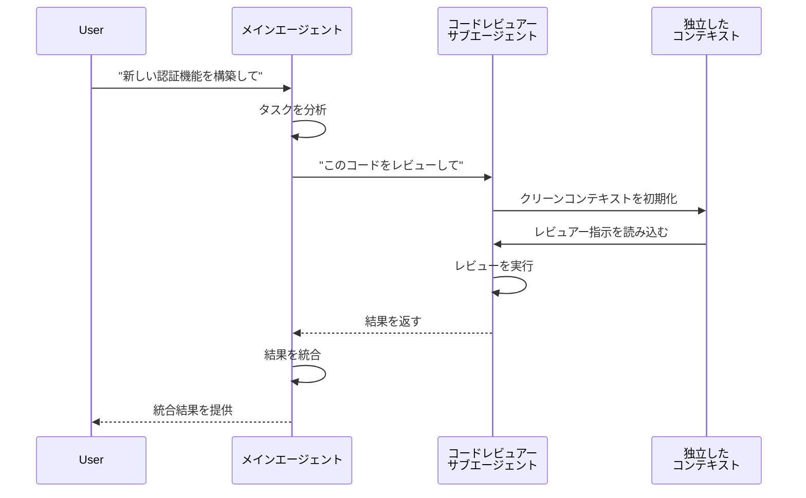
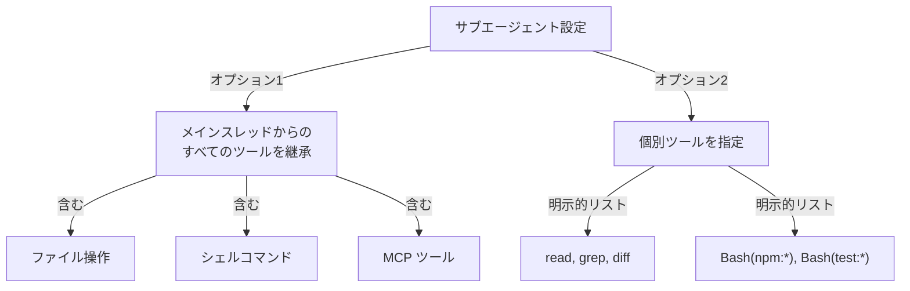
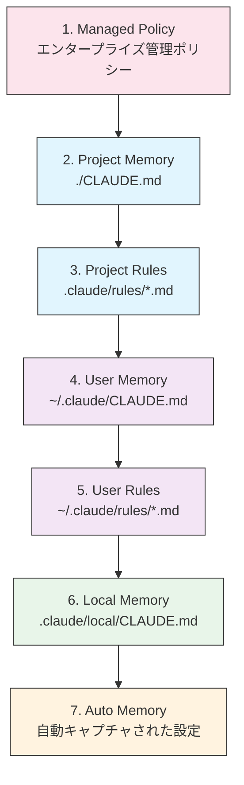
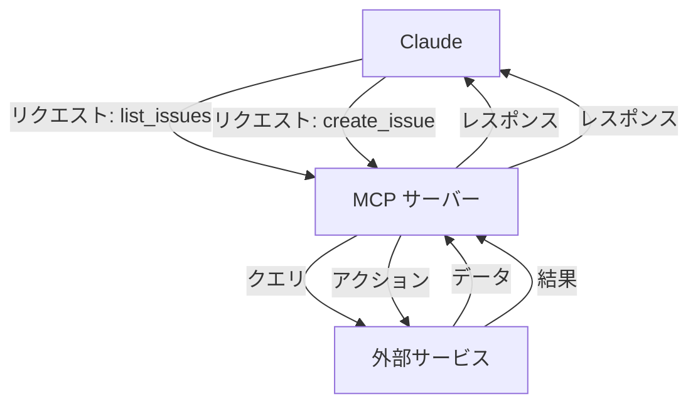
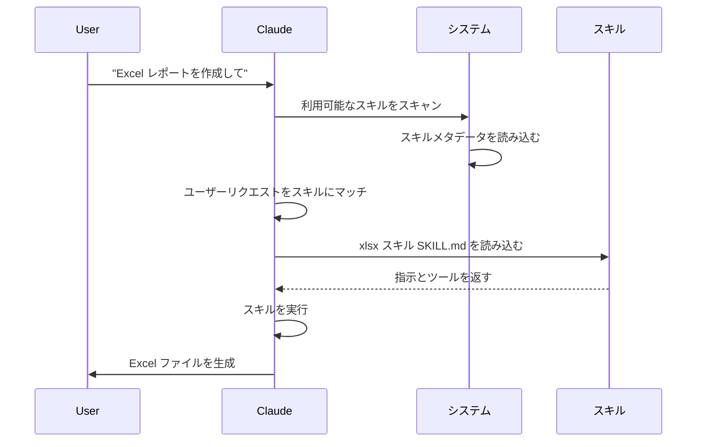
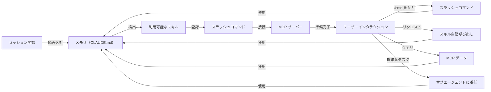

<picture>
  <source media="(prefers-color-scheme: dark)" srcset="resources/logos/claude-howto-logo-dark.svg">
  
</picture>

# Claude コンセプト完全ガイド

スラッシュコマンド・サブエージェント・メモリ・MCP プロトコル・エージェントスキルを含む包括的なリファレンスガイド。テーブル・ダイアグラム・実践的な例を含みます。

---

## 目次

1. [スラッシュコマンド](#スラッシュコマンド)
2. [サブエージェント](#サブエージェント)
3. [メモリ](#メモリ)
4. [MCP プロトコル](#mcp-プロトコル)
5. [エージェントスキル](#エージェントスキル)
6. [プラグイン](#claude-code-プラグイン)
7. [フック](#フック)
8. [チェックポイントと巻き戻し](#チェックポイントと巻き戻し)
9. [高度な機能](#高度な機能)
10. [比較・統合](#比較・統合)

---

## スラッシュコマンド

### 概要

スラッシュコマンドはユーザーが呼び出すショートカットで、Markdown ファイルとして保存されます。チームが頻繁に使うプロンプトとワークフローを標準化できます。

### アーキテクチャ



### ファイル構造

| 場所 | スコープ | 利用可能性 | ユースケース | Git 追跡 |
|----------|-------|--------------|----------|-------------|
| `.claude/commands/` | プロジェクト固有 | チームメンバー | チームワークフロー、共有標準 | ✅ はい |
| `~/.claude/commands/` | 個人 | 個別ユーザー | プロジェクト間の個人ショートカット | ❌ いいえ |

---

## サブエージェント

### 概要

サブエージェントは独立したコンテキストウィンドウと カスタマイズされたシステムプロンプトを持つ特化型 AI アシスタントです。タスク実行の委任を可能にしながら、関心の分離を保ちます。

### ライフサイクル



### 設定テーブル

| 設定 | タイプ | 目的 | 例 |
|--------|------|---------|---------|
| `name` | 文字列 | エージェント識別子 | `code-reviewer` |
| `description` | 文字列 | 目的とトリガー用語 | `包括的なコード品質分析` |
| `tools` | リスト/文字列 | 許可された機能 | `read, grep, diff, lint_runner` |
| `system_prompt` | Markdown | 動作指示 | カスタムガイドライン |

### ツールアクセス階層



### ユースケース

| シナリオ | サブエージェントを使う | 理由 |
|----------|--|-----|
| 複数ステップの複雑な機能 | ✅ はい | 関心を分離、コンテキスト汚染を防止 |
| クイックコードレビュー | ❌ いいえ | 不要なオーバーヘッド |
| 並列タスク実行 | ✅ はい | 各サブエージェントは独立したコンテキスト |
| 特化した専門知識が必要 | ✅ はい | カスタムシステムプロンプト |
| 単一タスク | ❌ いいえ | レイテンシーを追加するだけ |

---

## メモリ

### 概要

メモリを使うと、Claude がセッション間でコンテキストを保持できます。Claude Code ではファイルベースの `CLAUDE.md` で実装されています。

### メモリ階層（7層）

Claude Code は優先度順に7層からメモリを読み込みます:



### メモリ場所テーブル

| 層 | 場所 | スコープ | 優先度 | 共有 | 用途 |
|------|----------|-------|----------|--------|----------|
| 1. Managed Policy | エンタープライズ管理 | 組織 | 最高 | すべての組織ユーザー | コンプライアンス、セキュリティポリシー |
| 2. Project | `./CLAUDE.md` | プロジェクト | 高 | チーム（Git） | チーム標準、アーキテクチャ |
| 3. Project Rules | `.claude/rules/*.md` | プロジェクト | 高 | チーム（Git） | モジュール式プロジェクト慣例 |
| 4. User | `~/.claude/CLAUDE.md` | 個人 | 中 | 個人 | 個人設定 |
| 5. User Rules | `~/.claude/rules/*.md` | 個人 | 中 | 個人 | モジュール式個人ルール |
| 6. Local | `.claude/local/CLAUDE.md` | ローカル | 低 | 共有なし | マシン固有の設定 |
| 7. Auto Memory | 自動 | セッション | 最低 | 個人 | 学習された設定、パターン |

### Auto Memory

Auto Memory はユーザー設定とセッション中に観察されたパターンを自動的にキャプチャします。Claude は以下を学習します:

- コーディング スタイルの好み
- あなたが頻繁に行う修正
- フレームワークとツールの選択
- コミュニケーションスタイルの好み

Auto Memory はバックグラウンドで機能し、手動の設定は必要ありません。

---

## MCP プロトコル

### 概要

MCP（Model Context Protocol）は、Claude が外部ツール・API・リアルタイムデータソースにアクセスするための標準化された方法です。メモリとは異なり、MCP は変更されるデータへのライブアクセスを提供します。

### MCP アーキテクチャ



### 利用可能な MCP サーバー

| MCP サーバー | 目的 | 一般的なツール | 認証 | リアルタイム |
|------------|---------|--------------|------|-----------|
| **Filesystem** | ファイル操作 | read, write, delete | OS パーミッション | ✅ はい |
| **GitHub** | リポジトリ管理 | list_prs, create_issue, push | OAuth | ✅ はい |
| **Slack** | チームコミュニケーション | send_message, list_channels | トークン | ✅ はい |
| **Database** | SQL クエリ | query, insert, update | クレデンシャル | ✅ はい |
| **Google Docs** | ドキュメントアクセス | read, write, share | OAuth | ✅ はい |
| **Asana** | プロジェクト管理 | create_task, update_status | API キー | ✅ はい |
| **Stripe** | 決済データ | list_charges, create_invoice | API キー | ✅ はい |
| **Memory** | 永続メモリ | store, retrieve, delete | ローカル | ❌ いいえ |

---

## エージェントスキル

### 概要

エージェントスキルは指示・スクリプト・リソースを含むフォルダーとしてパッケージされた再利用可能でモデル呼び出しの機能です。Claude は関連するスキルを自動的に検出して使用します。

### スキル読み込みプロセス



### スキルタイプと場所テーブル

| タイプ | 場所 | スコープ | 共有 | 同期 | 用途 |
|------|----------|-------|--------|------|----------|
| Pre-built | 組み込み | グローバル | すべてのユーザー | 自動 | ドキュメント作成 |
| Personal | `~/.claude/skills/` | 個人 | いいえ | 手動 | 個人自動化 |
| Project | `.claude/skills/` | チーム | はい | Git | チーム標準 |
| Plugin | プラグイン経由 | 変動あり | 変動あり | 自動 | 統合機能 |

### バンドルスキル

Claude Code には5つのバンドルスキルが組み込まれています:

| スキル | コマンド | 目的 |
|-------|---------|---------|
| **Simplify** | `/simplify` | コードを複雑さとリューズのために見直す |
| **Batch** | `/batch` | 複数ファイル・項目に操作を実行 |
| **Debug** | `/debug` | 系統的なデバッグと根本原因分析 |
| **Loop** | `/loop` | 定期的なタスクをスケジュール |
| **Claude API** | `/claude-api` | Anthropic API と直接対話 |

---

## Claude Code プラグイン

### 概要

Claude Code プラグインはカスタマイズ（スラッシュコマンド・サブエージェント・MCP サーバー・フック）の統合コレクションで、1つのコマンドでインストールできます。

### プラグイン構造

```
my-plugin/
├── .claude-plugin/
│   └── plugin.json
├── commands/
├── agents/
├── skills/
├── hooks/
├── .mcp.json
├── templates/
├── scripts/
├── docs/
└── tests/
```

### 例: PR レビュープラグイン

**コンポーネント:**
- 3つのスラッシュコマンド: `/review-pr`, `/check-security`, `/check-tests`
- 3つのサブエージェント: security-reviewer, test-checker, performance-analyzer
- GitHub MCP 統合
- Pre-review フック

**インストール:**
```bash
/plugin install pr-review
```

---

## フック

### 概要

フックは Claude Code イベントに応じてシェルコマンドを実行するイベント駆動型の自動化です。自動化・検証・カスタムワークフローを可能にします。

### フックイベント（25イベント）

| フックイベント | トリガー | ユースケース |
|------------|---------|-----------|
| **SessionStart** | セッション開始/再開 | 環境セットアップ、初期化 |
| **UserPromptSubmit** | プロンプト処理前 | 入力検証 |
| **PreToolUse** | ツール実行前 | 検証、ログ |
| **PostToolUse** | ツール成功後 | 自動フォーマット、通知 |
| **Stop** | Claude がレスポンス完了 | クリーンアップ、レポート |
| **SubagentStart** | サブエージェント生成 | コンテキスト注入 |
| **SubagentStop** | サブエージェント完了 | アクションの連鎖 |
| **SessionEnd** | セッション終了 | クリーンアップ、最終ログ |

---

## チェックポイントと巻き戻し

### 概要

チェックポイントは会話状態を保存し、前のポイントに巻き戻すことで、安全な実験や複数のアプローチの探索を可能にします。

### 主要コンセプト

| コンセプト | 説明 |
|---------|-------------|
| **Checkpoint** | メッセージ・ファイル・コンテキストを含む会話状態のスナップショット |
| **Rewind** | 前のチェックポイントに戻る、その後の変更を破棄 |
| **Branch Point** | 複数のアプローチを探索するチェックポイント |

### アクセス

チェックポイントは毎回のユーザープロンプトで自動作成されます:

```bash
# Esc を2回押してチェックポイントブラウザーを開く
Esc + Esc

# または /rewind コマンドを使用
/rewind
```

---

## 高度な機能

### プランニングモード

詳細な実装計画をコーディング前に作成します。

**啓動:**
```bash
/plan ユーザー認証システムを実装
```

**メリット:**
- 時間見積もり付きロードマップ
- リスク評価
- タスク分解
- 確認・修正の機会

### 拡張思考

複雑な問題に対する深い推論。

**啓動:**
- セッション中に `Alt+T`（macOS では `Option+T`）を切り替え
- `MAX_THINKING_TOKENS` 環境変数を設定

### パーミッションモード

Claude ができることを制御します。

| モード | 説明 | ユースケース |
|------|-------------|----------|
| **default** | リスク行動の許可ダイアログ | 標準開発 |
| **acceptEdits** | ファイル編集を自動承認 | 信頼できる編集ワークフロー |
| **plan** | 分析と計画のみ、変更なし | コードレビュー、アーキテクチャ計画 |
| **auto** | 安全な操作を自動承認 | バランスの取れた自律性 |
| **dontAsk** | パーミッションプロンプトなし | 経験ユーザー、自動化 |
| **bypassPermissions** | 完全にアクセス制限なし | CI/CD、信頼済みスクリプト |

---

## 比較・統合

### 機能比較マトリクス

| 機能 | 呼び出し | 永続性 | スコープ | ユースケース |
|---------|-----------|------------|-------|----------|
| **スラッシュコマンド** | 手動（`/cmd`） | セッションのみ | 単一コマンド | クイックショートカット |
| **サブエージェント** | 自動委任 | 独立コンテキスト | 特化型タスク | タスク分配 |
| **メモリ** | 自動読み込み | クロスセッション | ユーザー/チームコンテキスト | 長期学習 |
| **MCP プロトコル** | 自動クエリ | リアルタイム外部 | ライブデータアクセス | 動的情報 |
| **スキル** | 自動呼び出し | ファイルベース | 再利用可能な専門知識 | 自動ワークフロー |

### インタラクションタイムライン



---

## クイックスタートガイド

### 第1週: シンプルにスタート
- スラッシュコマンドを2〜3つ作成
- メモリを設定で有効化
- チーム標準を `CLAUDE.md` に文書化

### 第2週: リアルタイムアクセスを追加
- 1つの MCP をセットアップ（GitHub またはデータベース）
- `/mcp` で設定
- ワークフローでライブデータをクエリ

### 第3週: 作業を分配
- 特定のロール用に最初のサブエージェントを作成
- `/agents` コマンドを使用
- シンプルなタスクで委任をテスト

### 第4週: すべてを自動化
- 繰り返された自動化用に最初のスキルを作成
- スキルマーケットプレイスまたはカスタムを使用
- 完全なワークフローのためにすべての機能を結合

### 進行中
- 毎月メモリを確認・更新
- 新しいパターンが出現したら新しいスキルを追加
- MCP クエリを最適化
- サブエージェントプロンプトを改良

---

## リソース

- [Claude Code ドキュメント](https://code.claude.com/docs/en/overview)
- [Anthropic ドキュメント](https://docs.anthropic.com)
- [MCP GitHub サーバー](https://github.com/modelcontextprotocol/servers)
- [Anthropic クックブック](https://github.com/anthropics/anthropic-cookbook)

---

*最終更新: 2026年4月16日*
*Claude Haiku 4.5・Sonnet 4.6・Opus 4.7 対応*
*含む: フック、チェックポイント、プランニングモード、拡張思考、バックグラウンドタスク、パーミッションモード（6種類）、ヘッドレスモード、セッション管理、Auto Memory、エージェントチーム、スケジュールされたタスク、Chrome 統合、チャンネル、音声辞書、バンドルスキル*

---
**最終更新**: 2026年4月16日
**Claude Code バージョン**: 2.1.112
**互換モデル**: Claude Sonnet 4.6・Claude Opus 4.7・Claude Haiku 4.5
